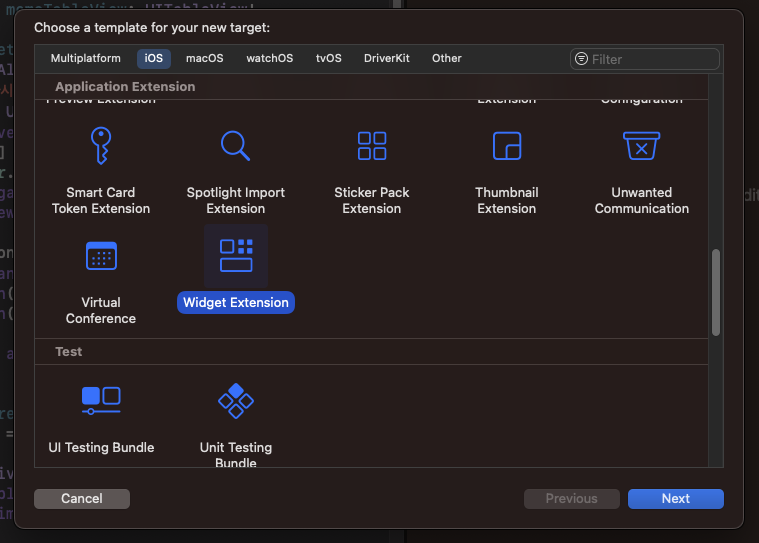

# 위젯 구현

위젯을 구현하기 위해 아래와 같이 크게 3단계로 작업하였다.

1. 위젯 데이터를 공유할 수 있는 모듈 구현
2. 데이터 통신 및 위젯 레이아웃 구현
3. 데이터 업데이트 로직 구현

## 위젯 데이터를 공유할 수 있는 모듈 구현

React Native의 javascript와 iOS, android 플랫폼별 네이티브 코드 사이에 위젯 관련 데이터를 공유할 수 있는 모듈이 필요하다. android에는 [SharedPreferences](https://developer.android.com/training/data-storage/shared-preferences?hl=ko), iOS에는 [NSUserDefault](https://developer.apple.com/documentation/foundation/nsuserdefaults)를 이용하여 앱 내에서 데이터를 공유할 수 있다.

### iOS

iOS의 경우 [react-native-shared-group-preferences](https://github.com/KjellConnelly/react-native-shared-group-preferences) 라이브러리를 사용하여 구현하였다. Xcode에서 App Groups에 원하는 appGroupIdentifier를 추가하여 데이터를 읽고 쓸 수 있다.

### Android

Android의 경우 sharedPreference를 이용해 위젯 데이터를 저장할 수 있는 Native Module을 작성하였다. Native Module을 구현하는 방식은 [공식 문서](https://reactnative.dev/docs/native-modules-android)를 통해 확인할 수 있다.

```java
public class SharedStorage extends ReactContextBaseJavaModule {
    ReactApplicationContext context;

    public SharedStorage(ReactApplicationContext reactContext) {
        super(reactContext);
        context = reactContext;
    }

    @ReactMethod
    public void set(String data) {
        SharedPreferences.Editor editor = context.getSharedPreferences("exampleKey", Context.MODE_PRIVATE).edit();
        editor.putString("widgetData", data);
        editor.commit();

        // AppWidgetManager를 이용한 위젯 업데이트
        ...
    }
}
```

set 메서드에 AppWidgetManager를 이용하여 위젯을 갱신하는 로직을 `데이터 업데이트 로직 구현` 단계에서 추가할 예정이다.

## 데이터 통신 및 위젯 구현

### iOS

Xcode에서 Widget Extension을 타겟으로 추가하게 되면 IntentTimelineProvider type의 Provider struct가 있는 swift 파일이 기본적으로 생성된다.

<!--
 -->

해당 파일에서 위젯에 필요한 데이터를 정의하고 업데이트할 수 있는 로직을 구현할 수 있다. 기본적으로 원하는 위젯 데이터 구조를 구현하도록 SimpleEntry라는 struct가 정의되어 있다. 아래와 같이 startDate, endDate를 이용하여 오늘을 기준으로 dday, countDay를 구할 수 있도록 작성하였다.

```swift
struct SimpleEntry: TimelineEntry {
  let startDate: String?
  let endDate: String?
  let configuration: ConfigurationIntent

// endDate까지 남은 일수
  var dday: Double {
    let dayInSeconds = 24 * 60 * 60
    let dateFormatter = DateFormatter()
    dateFormatter.dateFormat = "yyyy-MM-dd"

    let today = Calendar.current.startOfDay(for: Date()).timeIntervalSinceReferenceDate
    if let eDate = dateFormatter.date(from: endDate!)?.timeIntervalSinceReferenceDate {
      return (eDate - today) / (Double)(dayInSeconds)
    } else {
      return 0.0
    }
  }

// startDate로부터 지난 일수
  var countDay: Double {
    let dayInSeconds = 24 * 60 * 60
    let dateFormatter = DateFormatter()
    dateFormatter.dateFormat = "yyyy-MM-dd"

    let today = Calendar.current.startOfDay(for: Date()).timeIntervalSinceReferenceDate
    if let sDate = dateFormatter.date(from: startDate!)?.timeIntervalSinceReferenceDate {
      return floor((Double)(today - sDate) / (Double)(dayInSeconds)) + 1
    } else {
      return 0.0
    }
  }
}
```

### Android

## 데이터 업데이트 로직 구현

### iOS

Timeline

### Android

AlarmManager
