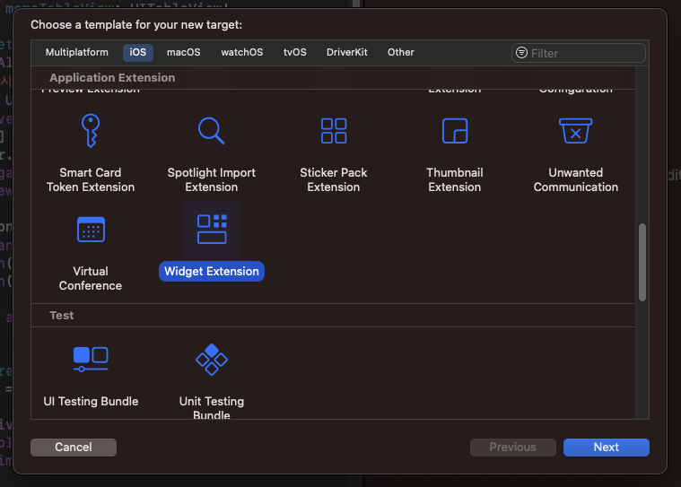

위젯을 구현하기 위해 아래와 같이 크게 3단계로 작업하였다.

1. 위젯 데이터를 공유할 수 있는 모듈 구현
2. 위젯 생성
3. 데이터 업데이트 로직 구현

## 위젯 데이터를 공유할 수 있는 모듈 구현

React Native의 javascript와 iOS, android 플랫폼별 네이티브 코드 사이에 위젯 관련 데이터를 공유할 수 있는 모듈이 필요하다. android에는 [SharedPreferences](https://developer.android.com/training/data-storage/shared-preferences?hl=ko), iOS에는 [NSUserDefault](https://developer.apple.com/documentation/foundation/nsuserdefaults)를 이용하여 앱 내에서 데이터를 공유할 수 있다.

iOS의 경우 [react-native-shared-group-preferences](https://github.com/KjellConnelly/react-native-shared-group-preferences) 라이브러리를 사용하여 구현하였다. Xcode에서 App Groups에 원하는 appGroupIdentifier를 추가하여 데이터를 읽고 쓸 수 있다.

## 위젯 생성

### iOS

Xcode에서 Widget Extension을 타겟으로 추가하게 되면 위젯 데이터 구조를 정의하고, 업데이트하는 타겟명과 동일한 swift 파일이 기본적으로 생성된다.

<!--
 -->

{: w="700" h="400" }

해당 파일에서 위젯에 필요한 데이터를 정의하고 업데이트할 수 있는 로직을 구현할 수 있다. 기본적으로 원하는 위젯 데이터 구조를 구현하도록 SimpleEntry라는 struct가 정의되어 있다. 아래와 같이 startDate, endDate를 이용하여 오늘을 기준으로 dday, countDay를 구할 수 있도록 작성하였다.

```swift
struct SimpleEntry: TimelineEntry {
  let date: Date
  let startDate: String?
  let endDate: String?
  let configuration: ConfigurationIntent

  // endDate까지 남은 일수
  var dday: Double {
    let dayInSeconds = 24 * 60 * 60
    let dateFormatter = DateFormatter()
    dateFormatter.dateFormat = "yyyy-MM-dd"

    let today = Calendar.current.startOfDay(for: Date()).timeIntervalSinceReferenceDate
    if let eDate = dateFormatter.date(from: endDate!)?.timeIntervalSinceReferenceDate {
      return (eDate - today) / (Double)(dayInSeconds)
    } else {
      return 0.0
    }
  }

  // startDate로부터 지난 일수
  var countDay: Double {
    let dayInSeconds = 24 * 60 * 60
    let dateFormatter = DateFormatter()
    dateFormatter.dateFormat = "yyyy-MM-dd"

    let today = Calendar.current.startOfDay(for: Date()).timeIntervalSinceReferenceDate
    if let sDate = dateFormatter.date(from: startDate!)?.timeIntervalSinceReferenceDate {
      return floor((Double)(today - sDate) / (Double)(dayInSeconds)) + 1
    } else {
      return 0.0
    }
  }
}
```

## 데이터 업데이트 로직 구현

widget swift 파일 내부의 Provider struct는 `placeholder`, `getSnapshot`, `getTimeline` 함수로 이루어져있으며 `placeholder`와 `getSnapshot`은 위젯을 선택하는 창에서 기본적으로 표시되는 위젯 형태를 정의하기 위해 사용되는 함수이다. 아래와 같이 SimpleEntry에 필요한 데이터를 임의로 넣어서 간단하게 구현하였다.

```swift
func placeholder(in context: Context) -> SimpleEntry {
    SimpleEntry(date: Date(), startDate: "2023-04-06", endDate: "2025-01-05", configuration: ConfigurationIntent())
  }

  func getSnapshot(for configuration: ConfigurationIntent, in context: Context, completion: @escaping (SimpleEntry) -> ()) {
    let entry = SimpleEntry(date: Date(), startDate: "2023-04-06", endDate: "2025-01-05", configuration: configuration)
    completion(entry)
  }
```

`getTimeline`의 경우 2번째 단계에서 정의한 SimpleEntry를 이용하여 entries를 정의하고 Timeline을 생성하여 위젯이 업데이트될 시간을 정의하는 역할을 한다. 크게 두가지 단계로 위젯 업데이트 Timeline을 구성하였다.

1. react-native-shared-group-preferences를 이용하여 javascript 코드 단에서 저장되었던 startDate, endDate 데이터를 가져옴
2. 업데이트가 되어야하는 시간대를 생성 후 가져온 데이터와 함께 entries 생성 후 Timeline 구성

디데이 위젯 특성상 자정에 한 번만 업데이트가 필요하므로 entires에는 하나의 SimpleEntry만 append하여 저장하였다.

```swift
func getTimeline(for configuration: ConfigurationIntent, in context: Context, completion: @escaping (Timeline<Entry>) -> ()) {
    var entries: [SimpleEntry] = []
    var startDate: String? = nil
    var endDate: String? = nil

    // NSUserDefaults에 저장된 데이터가져와서 decode
    let sharedDefaults = UserDefaults.init(suiteName: "exampleKey")
    if sharedDefaults != nil {
      do {
        let shared = sharedDefaults?.string(forKey: "widgetDataKey")
        if(shared != nil) {
          let data = try JSONDecoder().decode(Shared.self, from: shared!.data(using: .utf8)!)
          startDate = data.startDate
          endDate = data.endDate
        }
      } catch {
        print(error)
      }
    }

    // 매일 자정에 위젯 refresh 되도록 timeline 설정
    let calendar = Calendar.current
    let today = Date()
    let midnight = calendar.startOfDay(for: today)
    let entryDate = calendar.date(byAdding: .day, value: 1, to: midnight)!
    let entry = SimpleEntry(date: entryDate, startDate: startDate, endDate: endDate, configuration: configuration)
    entries.append(entry)

    let timeline = Timeline(entries: entries, policy: .atEnd)
    completion(timeline)
  }
```
